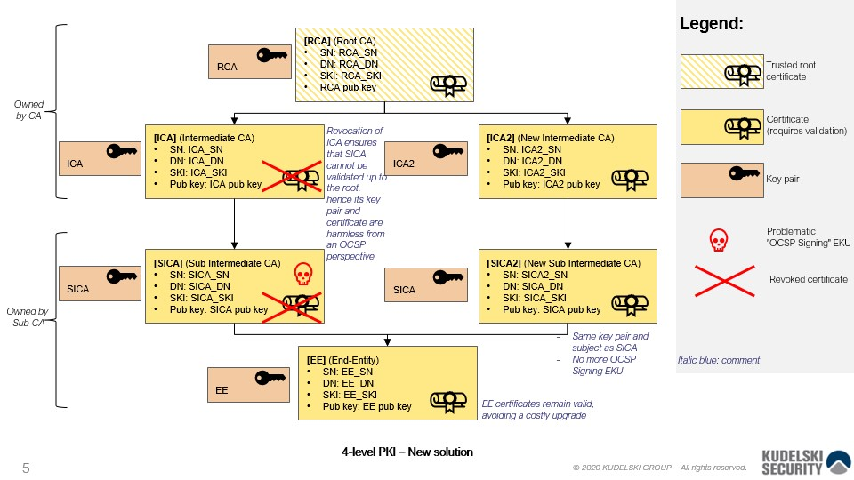

# Proof-of-concept new solution to the curious case of the Dangerous Delegated OCSP Responder Certificate

This repository contains material related to the blog post published on the [Kudelski Security Research blog](https://research.kudelskisecurity.com/?p=15180) 
about the `curious case of the dangerous delegated OCSP responder certificate`.

# Introduction

The main script generates a 4-level certificate hierarchy that reproduces the initial situation of the dangerous delegated OCSP responder certificate problem (see diagram below).Then it fixes the certificate hierarchy using the new solution described in the blog post and in the attached .pdf document (see `doc` directory).

The main script is written in Python and is available at `verifier-poc/main.py`.

The hierarchy is tested using `openssl verify` in the `verifier-poc/openssl-env/main.sh` script.

The generated files are also available in the `output` directory.



# Usage

The code can be run with Docker and docker-compose:

```
cd verifier-poc/openssl-env
docker-compose up
```

It should produce the following output:

```
$ docker-compose up
Starting openssl-env_openssl_1 ... done
Attaching to openssl-env_openssl_1
openssl_1  | >>> Running main.py ...
openssl_1  | Saving to file rca.pem ...
openssl_1  | Saving to file ica.pem ...
openssl_1  | Saving to file sica.pem ...
openssl_1  | Saving to file ee.pem ...
openssl_1  | Verify certificate signatures ...
openssl_1  | True
openssl_1  | True
openssl_1  | True
openssl_1  | True
openssl_1  | Saving to file ica2.pem ...
openssl_1  | Saving to file sica2.pem ...
openssl_1  | Saving to file rca.crl ...
openssl_1  | Saving to file ica2.crl ...
openssl_1  | Saving to file ica.crl ...
openssl_1  | Saving to file sica2.crl ...
openssl_1  | Verify CRL signatures ...
openssl_1  | True
openssl_1  | True
openssl_1  | True
openssl_1  | True
openssl_1  | 
openssl_1  | >>> Testing new chain locally ...
openssl_1  | ee.pem: OK
openssl_1  | Chain:
openssl_1  | depth=0: C = US, O = My Company, CN = firstname.lastname@mycompany.com (untrusted)
openssl_1  | depth=1: C = US, O = My Company, CN = My Company Name (untrusted)
openssl_1  | depth=2: C = US, O = Intermediate CA, CN = Intermediate CA Name (untrusted)
openssl_1  | depth=3: C = US, O = Root CA, CN = Root CA Name
openssl_1  | 
openssl_1  | >>> Testing old chain locally (should fail with invalid CRL signature) ...
openssl_1  | C = US, O = My Company, CN = My Company Name
openssl_1  | error 8 at 1 depth lookup: CRL signature failure
openssl_1  | 140640193668224:error:0407008A:rsa routines:RSA_padding_check_PKCS1_type_1:invalid padding:../crypto/rsa/rsa_pk1.c:67:
openssl_1  | 140640193668224:error:04067072:rsa routines:rsa_ossl_public_decrypt:padding check failed:../crypto/rsa/rsa_ossl.c:588:
openssl_1  | 140640193668224:error:0D0C5006:asn1 encoding routines:ASN1_item_verify:EVP lib:../crypto/asn1/a_verify.c:170:
openssl_1  | error ee.pem: verification failed
openssl_1  | 
openssl_1  | >>> Testing old chain locally but with CRL signed by old key (should fail and say certificate revoked) ...
openssl_1  | C = US, O = My Company, CN = My Company Name
openssl_1  | error 23 at 1 depth lookup: certificate revoked
openssl_1  | error ee.pem: verification failed
openssl-env_openssl_1 exited with code 2
```

# Contributing

Any input from the community is welcome!

Feel free to open a new issue to discuss the new solution or request features or cases that you would like to be tested.

# Disclaimer

This proof-of-concept only tests the technical feasibility of the new solution with OpenSSL and should not be considered as a hard proof. It is present as an illustrative purpose.

# License and Copyright

Copyright(c) 2020 Nagravision SA.

This program is free software: you can redistribute it and/or modify it under the terms of the GNU General Public License version 3 as published by the Free Software Foundation.

This program is distributed in the hope that it will be useful, but WITHOUT ANY WARRANTY; without even the implied warranty of MERCHANTABILITY or FITNESS FOR A PARTICULAR PURPOSE. See the GNU General Public License for more details.

You should have received a copy of the GNU General Public License along with this program. If not, see http://www.gnu.org/licenses/.
